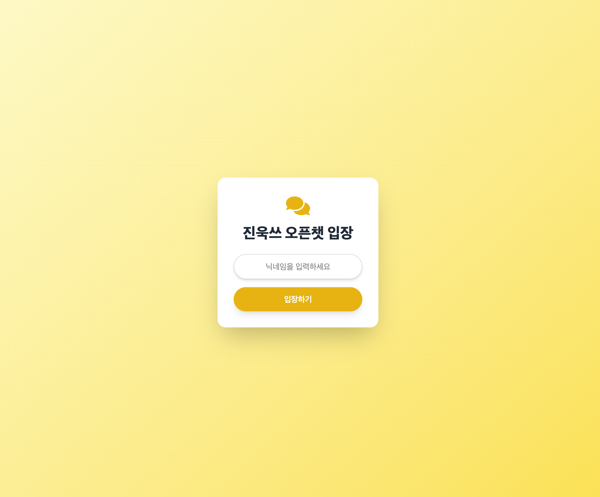
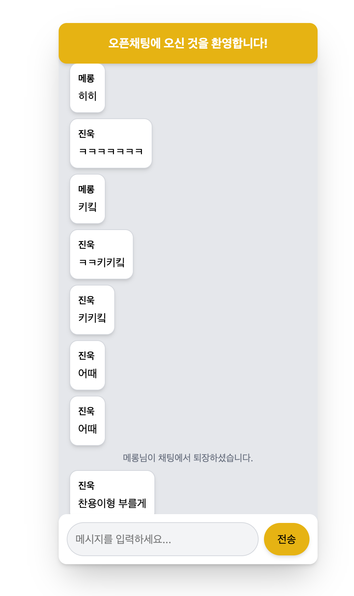
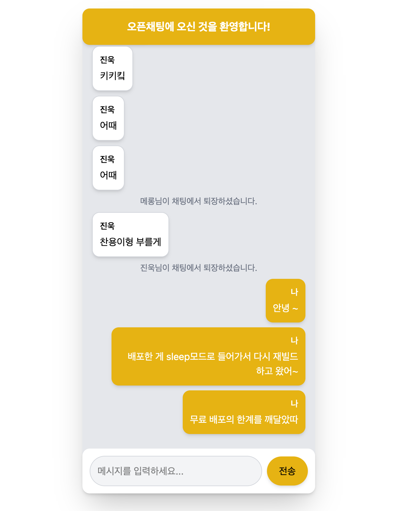

# OpenChat with Everyone

## 프로젝트 소개
실시간 웹 채팅 애플리케이션으로, Socket.IO와 Vite + React를 사용하여 구현한 오픈 채팅방입니다.

## 배포
- Frontend & Backend: [https://openchat-with-everyone.onrender.com]

## 참고 사항
- 무료 호스팅 서비스 특성 상, 15분 이상 사용하지 않으면 서버가 대기 모드로 전환됩니다.
- 대기 모드에서 깨어나는데 1-2분 정도 소요될 수 있으니 첫 접속 시 기다려주시기 바랍니다.

## 스크린샷




## 주요 기능
- 실시간 메시지 전송/수신
- 사용자 입장/퇴장 알림
- 과거 대화 내역 로드
- 간단한 반응형 디자인

## 기술 스택
- Frontend: React, Vite, TailwindCSS
- Backend: Node.js, Express
- 실시간 통신: Socket.IO
- 데이터베이스: MySQL
- 배포: Render(서버), Railway(DB)

## 프로젝트 구조
```
src/
├── components/
│   ├── chat.jsx          # 채팅 메시지 표시 컴포넌트
│   ├── ChatInput.jsx     # 메시지 입력 컴포넌트
│   ├── ChatPage.jsx      # 채팅방 메인 페이지
│   └── UserConnect.jsx   # 사용자 연결 페이지
├── App.jsx               # 메인 App 컴포넌트
└── main.jsx             # 앱 진입점

server.js                 # 백엔드 서버
```